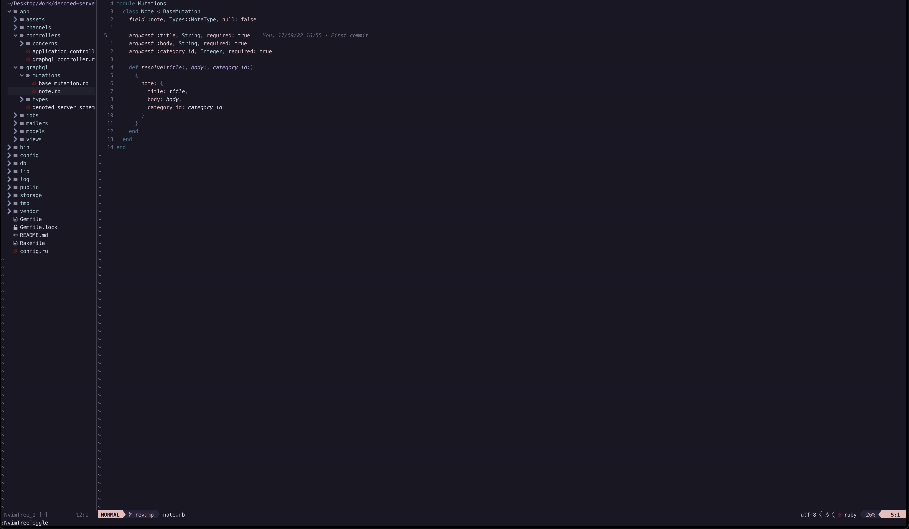

# Nvim Setup

Theme: rose-pine

Plugins:
- telescope
- nvim-treesitter
- undotree
- vim-fugitive
- lsp-zero
- mason
- nvim-cmp
- nvim-tree
- neoscroll
- nvim-autopairs
- nvim-colorizer
- lualine
- lspkind
- gitsigns
- blamer
- nvim-ts-autotag
- nvim-bufferline

